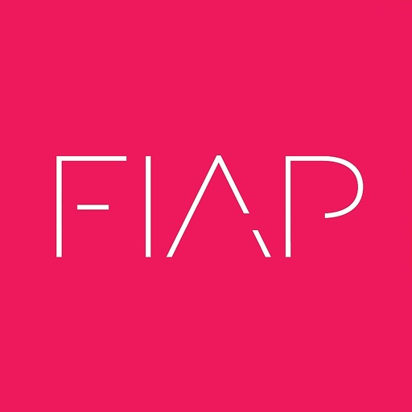

  

## Tech Challenge - Vitivinicultura Embrapa API
Este repositório foi criado com o objetivo de desenvolver uma API focada na vitivinicultura da Embrapa, como parte do desafio técnico da fase 1 da pós-graduação em Machine Learning Engineering.

### 👥 Grupo 
- Renato Martinelli
- Danilo Jang

### Objetivo
Baseado na Produção, Processamento e Comercialização, oferecer sugestões para melhoria da Exportação.

### Arquitetura

<a href="./2024-10-FIAP-3MLET-Arquitetura.pdf">FIAP-3MLET-Arquitetura.pdf</a>

A arquitetura da solução consiste de uma camada de APIs REST, cada qual apontando para um endpoint específco no site da EMBRAPA:
- Produção
- Processamento
- Comercialização
- Importação
- Exportação

As APIs podem ser consultadas isoladamente, internamente existe um mecanismo de download das informações para um arquivo CSV, que irá alimentar um banco de dados.
Este Banco de Dados serão as entradas para o Modelo de Machine Learning que construiremos na sequência.

### Pipeline

<a href="./2024-10-FIAP-3MLET-Pipeline.pdf">FIAP-3MLET-Pipeline.pdf</a>

A pipeline é construída usando GITHUB Actions seguindo o modelo Trunk-Based. Existe uma branch main e cada desenvolvimento é feito numa feature, que ao estarem prontas são integradas na main.
Ao ocorrer um push na branch main, inicia-se o workflow de CI que realiza as seguintes operações:
- Consultar os endpoints
- Baixar os CSV
- Gravar as informações no Banco de Dados
- Gerar Tag da versão atual criada

Caso o CI ocorra com sucesso, o Modelo de Machine Learning será criado / atualizado na sequência.

pipenv shell

pipenv install fastapi uvicorn requests
cd src/api/
uvicorn api:server.app --reload

